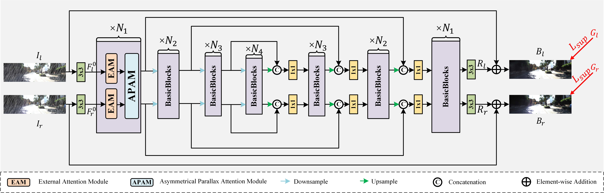
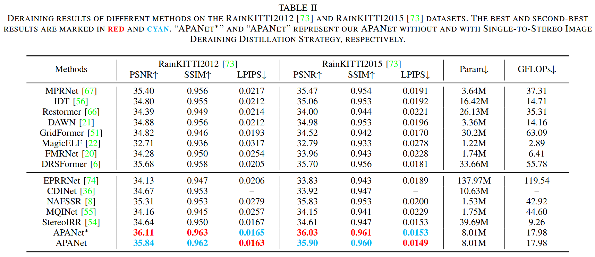

# APANet: Asymmetrical Parallax Attention Network For Efficient Stereo Image Deraining
**Chenglong Wang, Tao Yan, Weilong Huang, Xianglong Chen, Ke Xu, Xiaojun Chang, "APANet: Asymmetrical Parallax Attention Network For Efficient Stereo Image Deraining," IEEE Transactions on Computational Imaging, January 2025, <a href="https://ieeexplore.ieee.org/document/10833832">[10.1109/TCI.2025.3527142](https://doi.org/10.1109/TCI.2025.3527142)</a>**

> Abstract—Recently, several stereo image deraining methods have been proposed to recover clean backgrounds from rainy stereo images by exploring and exploiting intra and inter-view information. Despite these methods have achieved great progress, they under-utilize the parallax information of input images, and do not take advantage of existing high-quality and abundant single image rainy datasets for learning. In this paper, we propose an effective and efficient network, named Asymmetrical Parallax Attention Network (APANet), for stereo image deraining. Specifically, to fully exploit the parallax information, we first adopt an External Attention Module (EAM), which consists of an external attention block with two learnable memories, and a gated feedforward network, for achieving a better feature representation by incorporating the correlations between all samples. Subsequently, we propose an Asymmetrical Parallax Attention Module (APAM) to efficiently exploit the cross-attention between the features separately extracted from the left and right views, which filters useless stereo feature relationships with a well-designed mask calculated by excavating the parallax information (positional information of each matched pixel pair within a stereo image). For learning our network, we also construct an unpaired real-world stereo rainy image dataset, called StereoRealRain, which consists of some video clips (including 11803 image pairs). Moreover, we also introduce a Single-to-Stereo Image Deraining Distillation strategy for transferring the knowledge learned from single images deraining to stereo images deraining to improve the generalization ability of our network. Extensive experiments conducted on synthetic and real-world stereo rainy datasets demonstrate the effectiveness of our method. Our code and dataset will be available at https://github.com/YT3DVision/APANet.

## Network Architecture

## Quantitative Comparisons

## Dataset and pre-training models
**Dataset is as follows:**
**BaiDuYun:  https://pan.baidu.com/s/1A1qdvj1yY99YLHxGeYIXaQ code: pw53**
**Pretraining models are as follows:**
**BaiDuYun: https://pan.baidu.com/s/1687GsTXCIB5cdnrpHGS7OQ code: fw7u**
